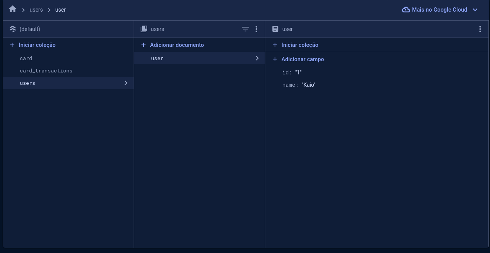
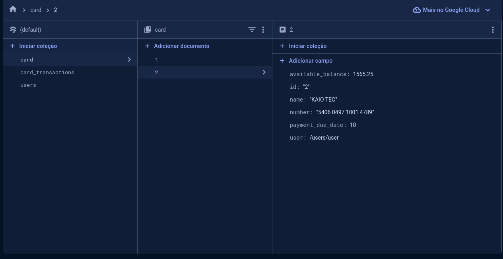
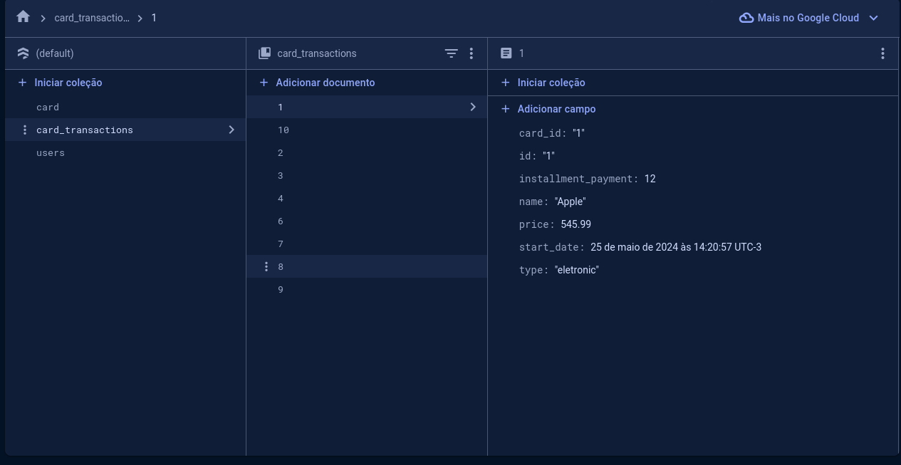

# Bank Simular

Este projeto consiste na criação de uma dashboard de um aplicativo bancário para simulação de operações financeiras. 
Foi desenvolvida uma integração com o Firestore Database para realizar as requisições necessárias.
A estrutura ficou conforme as imagens:

| Tabela Usuário          | Tabela Card             | Tabela Card Transactions |
|-------------------------|-------------------------|--------------------------|
|  |  |  |

Caso queira instalar o apk android, está disponível no meu drive: [Download do APK](https://drive.google.com/file/d/1pI4o5Jk73ICb3xg7gGoneQeCBrITqBMN/view?usp=sharing)

